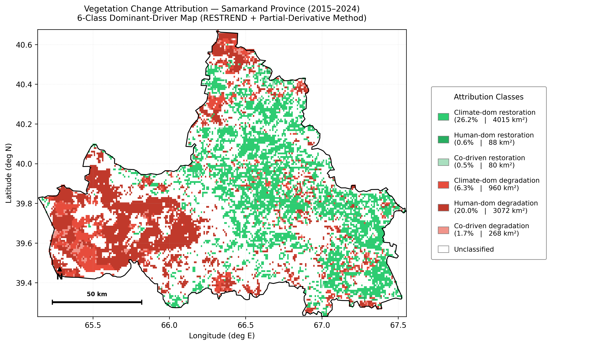

# Samarkand Vegetation Attribution (2015–2024)

**Per-pixel attribution of vegetation change in Samarkand Province, Uzbekistan, to climatic versus anthropogenic drivers — integrating MODIS, CHIRPS, ERA5-Land, and the Human Footprint Index in Python.**



*The headline result: a 6-class dominant-driver map of vegetation change across 20,132 valid 1 km pixels. The province splits into a non-climatic degradation regime in the grassland-dominated western lowlands (dark red) and a climate-dominated restoration regime in the cropland-dominated central and eastern districts (green).*

## What this project does

The semi-arid landscapes of Central Asia are changing under two simultaneous pressures: climate variability and human land use. Separating the two using satellite data alone is difficult. This project builds a reproducible pipeline that:

1. Acquires and harmonizes five remote-sensing and reanalysis datasets, plus a land-cover mask, to a common 1 km grid
2. Computes per-pixel monotonic trends with the non-parametric Theil–Sen + Mann–Kendall framework
3. Runs a per-pixel Residual Trend (RESTREND) regression to separate the climate signal from the non-climatic residual
4. Decomposes the observed NDVI trend into Climate Contribution (CC) and Human Attribution (HA) via partial derivatives
5. Cross-checks the linear attribution with an independent Random Forest model using a spatial 80/20 hold-out
6. Compares the residual trend with the independent Human Footprint (HFI) trend
7. Tests how sensitive every HFI-dependent result is to the 2018→2019 discontinuity in the HFI record

The output is a six-class map of what drives vegetation change in each pixel, together with the checks that show which parts of that attribution are robust.

---

## Key findings

- **Climate dominates the vegetation trend, and Land Surface Temperature is the strongest single predictor.** RESTREND attributes a per-pixel median of ~82% of the trend to climate and ~18% to the human term. The independent Random Forest gives the three climate variables 90.4% of the importance among the physical drivers (HFI 9.6%). Both results hold under every HFI treatment in the sensitivity test (HA% 18–19%; HFI importance 7.7–9.6%).
- **There is a clear west–east split.** The grassland-dominated western lowlands (west of ~66.1°E) combine NDVI decline, strongly negative residual trends and poor climate-model fit (median R² 0.16–0.43). The cropland-dominated centre and east combine greening, near-zero residuals and high R² (0.81–0.85).
- **Human-dominated degradation (Class 5) is the second-largest class, covering 20.0% of valid pixels (~3,072 km²).** 64% of these pixels lie in the west, and 87% are grassland. The HFI data cannot confirm a human cause, so Class 5 is best read as *non-climatic* degradation. HFI barely changes there, and the residual–HFI coefficient is significant in only 14.2% of Class-5 pixels.
- **The residual-vs-HFI validation does not independently support the human attribution.** The original correlation was positive (Spearman ρ = +0.383, Pearson r = +0.338). However, the HFI layers for 2019–2024 come from a later, undocumented extension of the figshare record and contain a +2.62 mean step from 2018 to 2019, concentrated in the east. Once that step is removed, the correlation largely disappears (ρ = +0.173, r = +0.062). The class areas also depend strongly on how HFI is treated (Class 1 falls from 26.2% to 15.4% of valid pixels).

---

## Methods at a glance

| Stage                         | Method                                                | Key reference                             |
|---                            |---                                                    |---                                        |
| Trend detection               | Theil–Sen slope + Mann–Kendall test (n = 10)          | Sen 1968; Mann 1945; Kendall 1975         |
| Climate–vegetation regression | Per-pixel OLS, vectorized via `numpy.einsum` + `pinv` | Evans & Geerken 2004; Wessels et al. 2007 |
| Attribution                   | Partial-derivative decomposition (CC, HA)             | Tuo et al. 2024; Lu et al. 2025           |
| Cross-validation              | Random Forest with spatial 80/20 hold-out (MD5-hashed)| Breiman 2001; Roberts et al. 2017         |
| Final classification          | Six-class dominant-driver decision rule               | Tuo et al. 2024                           |
| Robustness                    | HFI sensitivity: original / step-adjusted / frozen at 2018 | —                                    |

---

## Data sources

All datasets are harmonized to **EPSG:4326, a ~1 km (0.008983°) grid of 269 × 161 pixels**, clipped to the Samarkand AOI. The variables are aggregated to growing-season (April–October) annual values for 2015–2024.

| Variable                  | Product                                  | Native resolution         | Source                                    |
|---                        |---                                       |---                        |---                                        |
| NDVI                      | MODIS MOD13Q1 Collection 6.1 (`MODIS/061/MOD13Q1`) | 250 m, 16-day   | NASA LP DAAC via Google Earth Engine      |
| Land Surface Temperature  | MODIS MOD11A2 Collection 6.1 (`MODIS/061/MOD11A2`, LST_Day_1km) | ~1 km, 8-day | NASA LP DAAC via Google Earth Engine |
| Precipitation             | CHIRPS v2.0                              | 0.05° (~5.5 km), monthly  | UCSB Climate Hazards Center               |
| Solar Radiation           | ERA5-Land SSRD                           | 0.1° (~11 km), hourly     | Copernicus Climate Data Store             |
| Human Footprint (HFI)     | Mu et al. (2022), 0–50 index. 2015–2018 from the peer-reviewed release; 2019–2024 from later versions of the record (v8) | ~1 km, annual | figshare, [doi:10.6084/m9.figshare.16571064.v8](https://doi.org/10.6084/m9.figshare.16571064.v8) |
| Land cover (mask)         | ESA WorldCover 2021 v200                 | 10 m                      | ESA / Zenodo                              |
| Study-area boundary       | Samarkand Province administrative boundary | vector                  | OCHA COD-AB / GADM                        |

---

## ⚠️ Datasets must be downloaded separately

**The raw data are not included in this repository.** They comprise 491 GeoTIFFs (~65 MB) plus the AOI shapefile. You must download them yourself before any script will run. [`links.txt`](links.txt) gives the full source, citation, folder name and filename pattern for each dataset.

1. **Create a data root folder** (in this README it is called `DATA_ROOT`). Put the raw data in it, using exactly these folder and file names:

   | Folder                               | Files                                                   | How to obtain |
   |---                                   |---                                                      |---            |
   | `MOD13Q1_MONTHLY_NDVI/`              | `MOD13Q1_NDVI_YYYY_MM_samarkand_4326.tif` (120)         | Run `scripts/gee/ndvi_monthly_downloader.js` in the GEE Code Editor |
   | `TEMPERATURE_MOD11A2_MONTHLY/`       | `MOD11A2_LST_YYYY_MM_samarkand_4326.tif` (120)          | Run `scripts/gee/temperature_monthly_downloader.js`. **Set `endYear = 2024` first** (the script defaults to 2019). It exports to a Drive folder named `MOD11A2_MONTHLY`, so rename that folder. |
   | `CHIRPS_MONTHLY_PRECIPITATION/`      | `CHIRPS_MONTHLY_YYYY_MM_samarkand_4326.tif` (120)       | CHIRPS v2.0 monthly totals (GEE `UCSB-CHG/CHIRPS/DAILY` summed per month, or from CHC) |
   | `ERA5_SSRD_1km_Monthly_solar_rad/`   | `ERA5_SSRD_1km_YYYY_MM.tif` (120, monthly mean W m⁻²)   | Copernicus CDS (ERA5-Land hourly SSRD) |
   | `hfp_2015-2024/`                     | `hfpYYYY_samarkand.tif` (10)                            | figshare record 16571064 (files `hfp2015` … `hfp2024`), clipped to the AOI |
   | `ESA_world_cover/`                   | `ESA_WorldCover_2021_Clipped.tif`                       | ESA WorldCover 2021 v200 tiles, mosaicked and clipped to the AOI |
   | `AOI/`                               | `samarkand_region.shp` (+ `.dbf`, `.prj`, `.shx`, `.cpg`) | OCHA COD-AB / GADM, level-1 boundary of Samarkand |

   This repository does not include download scripts for CHIRPS, ERA5-Land, HFI or WorldCover. Download those manually from the sources listed in `links.txt`. Before running the GEE scripts, upload the AOI shapefile as a GEE asset and edit the `aoi` asset path at the top of each script.

2. **Point the scripts at your data root.** `01_align_rasters.py`, `02_build_stacks.py` and the two `scripts/revision/` scripts read the data folder from the `DATA_ROOT` environment variable. If it isn't set, they use the current directory. All other scripts use relative paths (`analysis_stacks.npz`, `Trends/`, `RESTREND/`, `RF_model/`, `figures/`), so run everything with `DATA_ROOT` as the working directory, and create those output sub-folders first. In the GEE scripts, replace `projects/your-gee-project/assets/samarkand_region` with the path of your own uploaded AOI asset.

3. **Run the pipeline in this order:**

   ```bash
   pip install -r requirements.txt
   cd DATA_ROOT
   python <repo>/scripts/processing/01_align_rasters.py        # master grid, aligned rasters, veg_mask.tif
   python <repo>/scripts/processing/02_build_stacks.py         # analysis_stacks.npz
   python <repo>/scripts/processing/compute_trends.py          # Trends/*.tif
   python <repo>/scripts/processing/compute_restrend.py        # RESTREND/*.tif, residuals.npz
   python <repo>/scripts/processing/compute_attribution.py     # CC, HA, attribution_6class.tif
   python <repo>/scripts/processing/train_rf.py                # RF_model/
   python <repo>/scripts/processing/validate_residual_hfi.py   # residual-vs-HFI statistics
   python <repo>/scripts/processing/make_figures.py            # original figure set
   python <repo>/scripts/revision/hfi_sensitivity.py  out.json          # HFI discontinuity test
   python <repo>/scripts/revision/make_figures_revised.py  <out_dir>    # revised Figs 3, 4, 5 and 9
   ```

---

## Tech stack

**Language:** Python 3.10+
**Geospatial:** rasterio · geopandas
**Numerical:** numpy · pandas · scipy
**Statistics:** pymannkendall
**Machine learning:** scikit-learn (Random Forest with spatial hold-out)
**Parallelism:** joblib · tqdm
**Visualization:** matplotlib
**Data acquisition:** Google Earth Engine Code Editor (JavaScript) · Copernicus CDS

---

## Reading the result

The complete write-up is in [`docs/report.pdf`](docs/report.pdf). It covers the full methodology, sensor physics, results, the HFI sensitivity analysis and the limitations. The report has nine figures. Eight of them are in `figures/`:

| File                       | Report figure | Content |
|---                         |---            |---      |
| `fig1.png`                 | Figure 1      | Study area: mean growing-season NDVI (Apr–Oct 2015–2024, MOD13Q1 C6.1), AOI boundary, Zarafshan River and Samarkand city |
| —                          | Figure 2      | Workflow diagram. It appears only in the PDF report; no PNG is included here. |
| `fig3.png`                 | Figure 3      | Theil–Sen slope maps for (a) NDVI, (b) LST, (c) precipitation, (d) solar radiation, (e) HFI |
| `fig4.png`                 | Figure 4      | RESTREND: (a) climate-only model R², (b) Sen slope of the residual (non-climatic NDVI trend) |
| `fig5.png`                 | Figure 5      | Partial-derivative attribution: (a) Climate Contribution (CC), (b) Human Attribution (HA) |
| `fig6.png`                 | Figure 6      | **Six-class attribution map (headline result)** |
| `fig7.png`                 | Figure 7      | Random Forest feature importances: (a) all 7 features, (b) climate + HFI only |
| `fig8_validation.png`      | Figure 8      | Hexbin of residual Sen slope vs HFI Sen slope, with marginal histograms, statistics and quadrant counts |
| `fig9.png`                 | Figure 9      | HFI temporal consistency: (a) mean annual HFI by longitude zone, (b) per-pixel HFI change 2018→2019 |

Figures 3, 4, 5 and 9 come from `scripts/revision/make_figures_revised.py`. Figures 6 and 7 come from `scripts/processing/make_figures.py`. The published versions of Figure 1 and Figure 8 are restyled versions of the plots in `make_figures.py` and `make_validation_figures.py`.

---

## Limitations

This project is a research portfolio piece, not an operational product. The most important caveats:

- **HFI temporal consistency.** The 2019–2024 HFI layers are a provisional, undocumented extension of the Mu et al. (2022) record and have a step change between 2018 and 2019. The residual–HFI correlation and the class areas depend on how that step is treated; the dominance of climate does not.
- **Class 5 is non-climatic, not proven human.** In the west the climate model explains little of the variance, and HFI hardly changes. The non-climatic decline there could also come from grazing that HFI does not resolve, from irrigation or groundwater changes, or from lagged drought effects.
- With only n = 10 annual observations, individual-pixel Mann–Kendall significance is conservative (|τ| > 0.51 required for p < 0.05).
- No additional MODIS QA/QC masking was applied beyond the product compositing.
- MODIS LST measures surface temperature, not air temperature. In semi-arid daytime conditions the two can differ by 5–15 °C.
- The pipeline assumes a linear NDVI–climate relationship per pixel. The Random Forest cross-check partly addresses this but does not replace the linear attribution.

A full Limitations section appears in the PDF report.

---

## Contact

Rasul Anvar · anvarjon.rasulov777@gmail.com · [LinkedIn](https://www.linkedin.com/in/anvar-rasul-b3991828b/)
Open to roles in GIS analysis, geospatial data science, and environmental data analysis.
